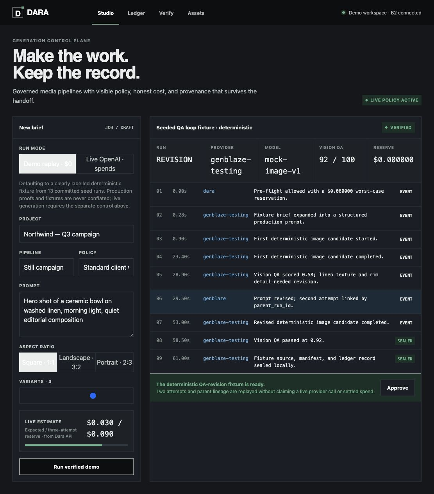
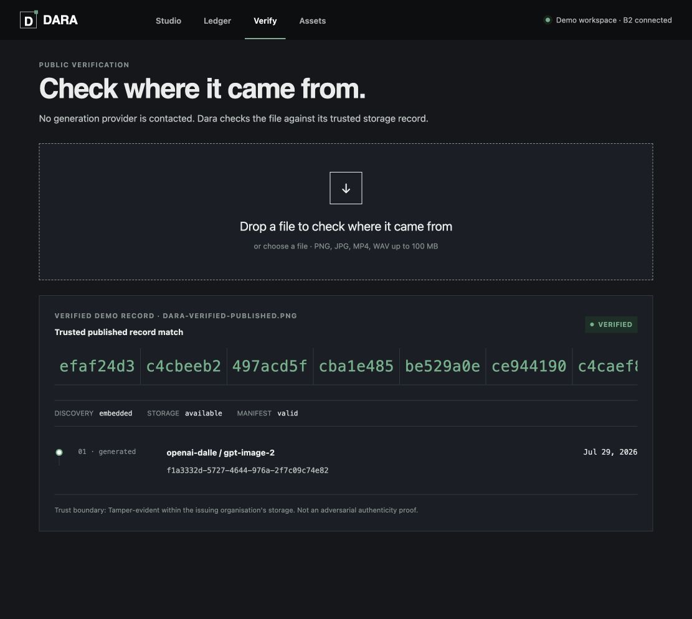
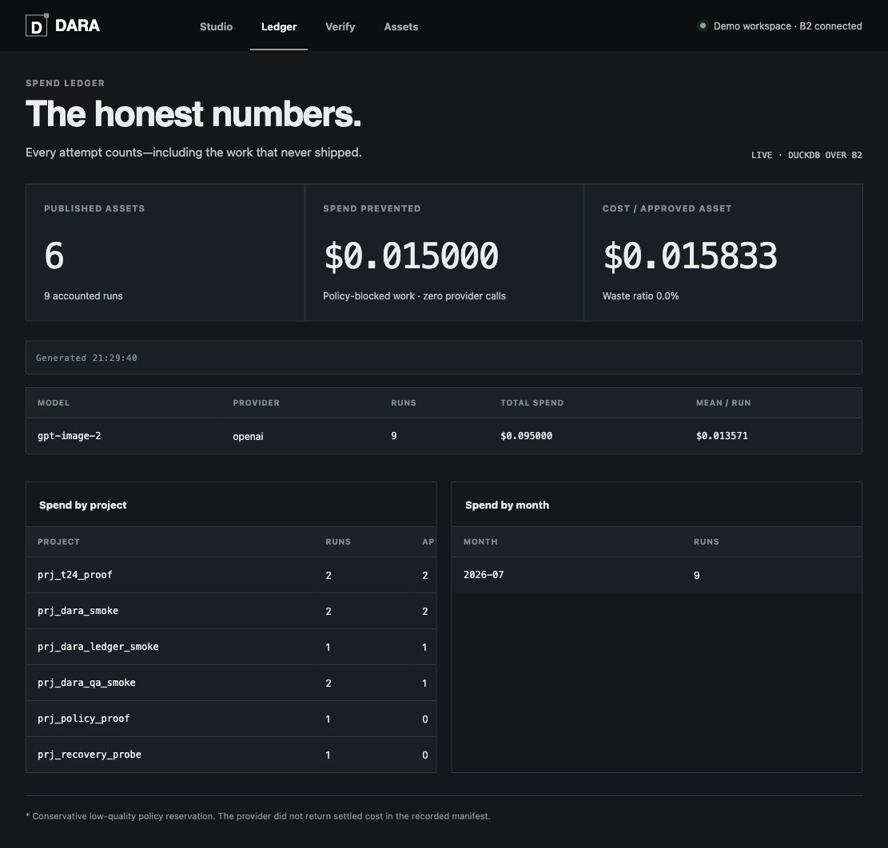

# Dara

**Dara is the control plane for AI-generated media: governed pipelines, verifiable
provenance, and an honest spend ledger built on Genblaze and Backblaze B2.**

[Live application](https://diamonds-jessica-accidents-icq.trycloudflare.com) ·
[Deployment evidence](docs/DEPLOYMENT.md) ·
[Trust model](docs/PRD.md#the-trust-model)

> No test account is required. Studio demo replay, Verify, Assets, and the aggregate
> live Ledger are public; signing in with ChatGPT is only for actions that can start
> live provider spend.

## The problem

A creative team generating thousands of assets across model providers has no durable
answer to basic operational questions: What did this asset cost, including discarded
attempts? Which exact model and parameters produced it? Can the same conditions be
reconstructed? Did policy approve it before money was spent? What provenance can be
shared without leaking the prompt library?

Dara makes those answers part of the media supply chain instead of leaving them in
spreadsheets, chat history, and provider dashboards.

## A 60-second tour

### 1. Generate under policy



Demo replay is the default and costs nothing. The committed 13-run corpus includes still,
motion, voice, regeneration, two zero-spend policy blocks, and a deterministic QA
fail-revise-pass path. Live OpenAI generation is a separate, spend-labelled action.

### 2. Verify the delivered bytes



Dara extracts the Genblaze manifest and checks its canonical integrity, then compares the
uploaded file's whole-file SHA-256 with the trusted `published_sha256` stored in B2. A
valid foreign manifest is reported only as self-consistent; a changed trusted file fails
closed as a mismatch.

### 3. Account for every attempt



The live ledger queries immutable accounting Parquet directly in B2 with DuckDB. Failed,
rejected, and policy-blocked work stays visible, so cost per approved asset includes the
work that did not ship.

## What Dara does

- **Verify:** public, no-provider-call file verification with embedded-manifest and
  content-addressed lookup paths.
- **Govern:** typed policies enforced pre-flight, before every provider step, after QA,
  and after embedding but before publication.
- **Generate:** Genblaze still, motion, voice-pack, and regeneration workflows with
  fallback chains, streaming events, structured prompt expansion, and agentic visual QA.
- **Account:** immutable per-run Parquet in B2, queried in place by DuckDB for spend,
  waste, savings, and cost per approved asset.
- **Disclose:** expiring, token-scoped client shares that expose limited provenance
  without leaking prompts, parameters, job IDs, or run IDs.

## Judging criteria

| Criterion | Where to look | Evidence |
|---|---|---|
| **Real-world utility** | [`docs/PRD.md`](docs/PRD.md), [`app/verify/page.tsx`](app/verify/page.tsx), [`app/ledger/page.tsx`](app/ledger/page.tsx) | A named buyer and five concrete questions; verify and ledger remain useful without starting generation. |
| **Production readiness** | [`api/dara/policy/`](api/dara/policy/), [`api/dara/jobs.py`](api/dara/jobs.py), [`api/dara/main.py`](api/dara/main.py), [`api/tests/`](api/tests/) | Pre-spend policy blocks, atomic reservations, B2-backed restart recovery, rate limits, typed errors, fallback routes, 66 zero-network regressions, and measured deployment evidence. |
| **B2 storage and data orchestration** | [`api/dara/storage.py`](api/dara/storage.py), [`api/dara/ledger.py`](api/dara/ledger.py), [`docs/DATA_MODEL.md`](docs/DATA_MODEL.md) | One B2 bucket holds source assets, delivered derivatives, manifests, job/policy/share state, hash indexes, and immutable Parquet. There is no application database. |
| **Use of Genblaze** | [`api/dara/pipelines/`](api/dara/pipelines/), [`api/dara/verify.py`](api/dara/verify.py), [`api/dara/share.py`](api/dara/share.py) | Multi-step pipelines, `input_from` fan-in, `fallback_models`, `AgentLoop`, `parent_run_id`, `ObjectStorageSink`, `ParquetSink`, `EmbedPolicy`, manifest embed/extract/verify, `ModelRegistry`, `astream()`, `abatch_run()`, replay semantics, and `LoggingTracer`. |

## Architecture

```text
Next.js public judge server on TierHive
  Studio · Ledger · Verify · Share
            │ HTTPS + SSE
            ▼
FastAPI + Genblaze on TierHive, London
  policy · pipelines · jobs · ledger · verification
            │                         │
            │ OpenAI                  │ S3 API
            ▼                         ▼
  media + QA providers       Backblaze B2, us-east-005
                              the only datastore
```

The web server and Python API are separate always-on services on the same VPS and bind
only to loopback; independent HTTPS tunnels expose them. The API remains a single
instance because admission control and job execution use in-process locks. Durable state
is in B2, so restart reconciliation can fail orphaned work safely and rebuild the daily
spend commitment. A multi-instance API would require an external transactional
coordinator.

### One bucket, distinct byte roles

```text
dara/live/runs/{tenant}/{date}/{run_id}/     Genblaze run grouping
dara/assets/{aa}/{bb}/{source_sha}.ext       immutable source bytes
dara/published/{aa}/{bb}/{published_sha}.ext exact delivered bytes
dara/share-assets/{token}/{asset_id}.ext     redacted client derivatives
dara/manifests/{run_id}.json                 provenance
dara/index/sha/{sha}.json                    source/published lookup
dara/ledger/{table}/year=YYYY/month=MM/*.parquet
dara/state/{jobs,live-runs,policies,projects,shares}/
```

Genblaze's source hash and Dara's delivered-file hash are deliberately different.
Embedding changes a file, so Dara never overwrites the Genblaze-bound source and never
pretends those two hashes should match.

## Providers and models

OpenAI is the only configured AI provider. Genblaze is the orchestration and provenance
SDK, not a provider. The inventory is generated from
[`api/dara/providers.py`](api/dara/providers.py):

| Model | Use | Evidence |
|---|---|---|
| `gpt-image-2` | Primary image generation | Production calls persisted and verified in B2 |
| `gpt-image-2-2026-04-21` | Image fallback | Configured and account-catalog verified |
| `gpt-4.1-mini` | Prompt expansion and vision QA | Production calls recorded |
| `sora-2` → `sora-2-pro` | Motion generation | Pipeline and deterministic integration proof |
| `tts-1` → `tts-1-hd` | Voice generation | Parallel pipeline and deterministic integration proof |

See [`docs/MODELS_USED.md`](docs/MODELS_USED.md) for the generated submission table and
[`docs/PROVIDERS.md`](docs/PROVIDERS.md) for measurement and cost-basis details.

## Run locally

Requirements: Python 3.12+, Node.js 22.13+, and FFmpeg for the motion regression.

```bash
git clone <repository-url>
cd dara
cp .env.example .env

python3.12 -m venv api/.venv
api/.venv/bin/pip install --upgrade pip
api/.venv/bin/pip install -e api

npm ci
```

For the zero-spend demo, leave `DARA_LIVE_GENERATION_ENABLED=false`. B2 credentials are
required for durable state and the live ledger; `OPENAI_API_KEY` is required only for
explicit live generation.

Start the API:

```bash
set -a
source .env
set +a
api/.venv/bin/uvicorn dara.main:app --app-dir api --port 8000
```

In a second terminal, load the same server-side variables and start the web app:

```bash
set -a
source .env
set +a
npm run dev
```

Open `http://localhost:3000`. The committed demo replay is available without making a
provider call.

## Verify the build

```bash
PYTHONPATH=api api/.venv/bin/python -m unittest discover -s api/tests -v
npm run lint
npm test
```

The provider/model inventory is reproducible:

```bash
PYTHONPATH=api api/.venv/bin/python -m dara.tools.list_models
```

## Honest limitations

- **Tamper-evident, not tamper-proof.** Dara is authoritative within an organisation
  controlling its trusted B2 records. It is not an adversarial authenticity system;
  C2PA or an external signer is the appropriate next layer.
- **Reproducible conditions, not identical bytes.** Media models are generally
  non-deterministic. Regeneration replays canonical parameters and records lineage.
- **One writer per job.** B2 has no compare-and-swap transaction for these JSON records;
  concurrent updates to the same job are last-write-wins.
- **One real AI provider today.** Every generative step has a model fallback, but the
  image chain is not provider-diverse until a second media-provider credential is added.
- **Temporary HTTPS transport.** The current account-less Cloudflare tunnel survives API
  deployments but changes after a VPS or tunnel restart. The named-tunnel/custom-domain
  upgrade and recovery procedure are documented in [`docs/DEPLOYMENT.md`](docs/DEPLOYMENT.md).

## Genblaze feedback

Reproducible SDK findings and workarounds live in
[`docs/SDK_FEEDBACK.md`](docs/SDK_FEEDBACK.md):

- [`#238` — pointer-mode output path can be nonexistent](https://github.com/backblaze-labs/genblaze/issues/238)
- [`#239` — successful fallback erases the failed primary attempt](https://github.com/backblaze-labs/genblaze/issues/239)
- [`#240` — `DalleProvider` drops GPT Image response usage](https://github.com/backblaze-labs/genblaze/issues/240)

## License

MIT
